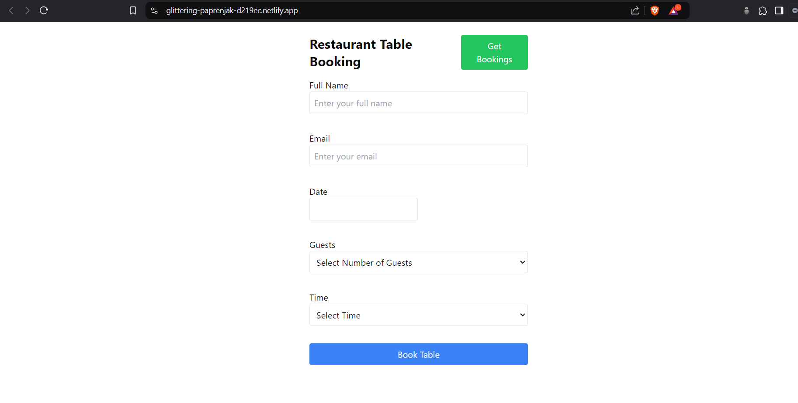
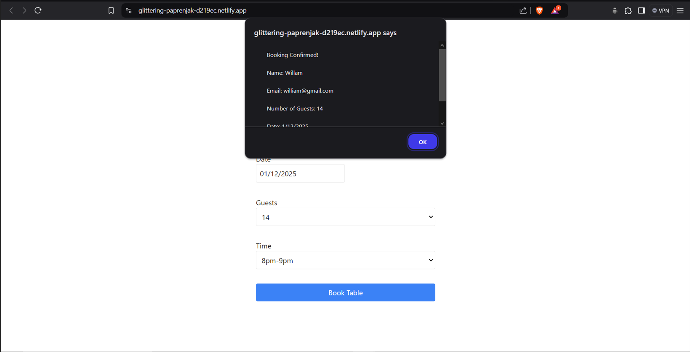
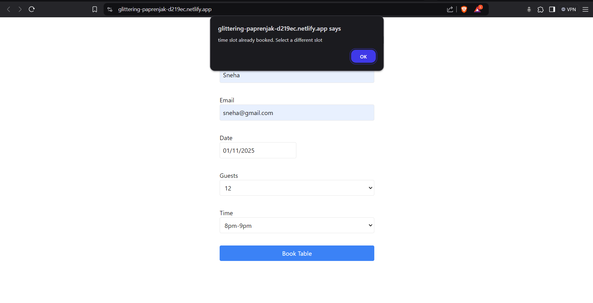
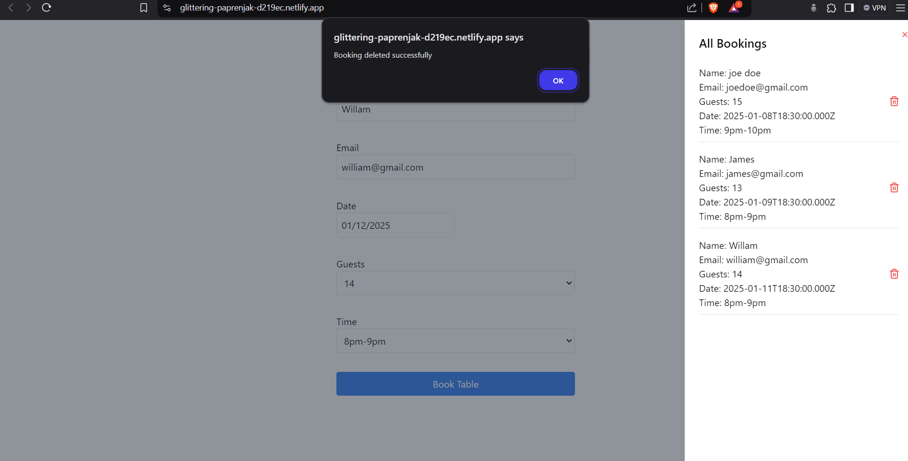
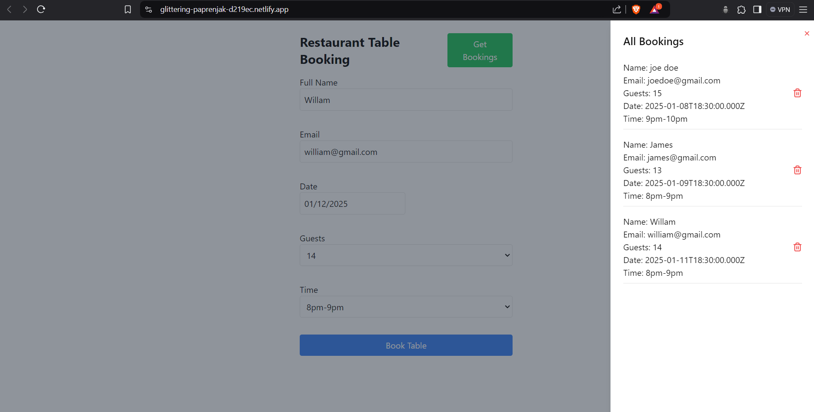

# MERN Table Booking App

A full-stack MERN application where users can book tables, view existing bookings, and delete them. Built with **Next.js** for the frontend, **Node.js** and **Express** for the backend, and **MongoDB** for data storage.

## Features

- **User Booking**: Users can choose a date and time to book a table.
- **View All Bookings**: Users can see all the existing bookings.
- **Delete Bookings**: Users can delete their existing bookings.

## Technologies Used

- **Frontend**: 
  - Next.js
  - React
  - Tailwind CSS (for styling)
  
- **Backend**:
  - Node.js
  - Express.js
  
- **Database**:
  - MongoDB

## live link

- **https://glittering-paprenjak-d219ec.netlify.app/**;

## Project Images 

